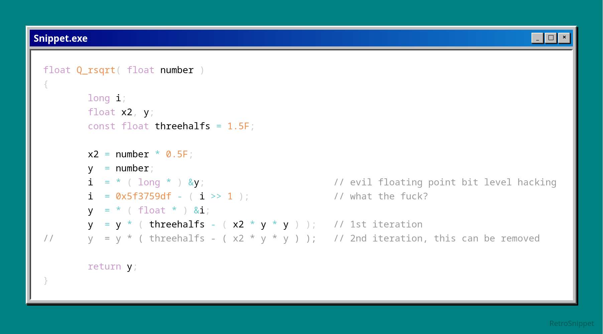

# RetroSnippet

A code snippet sharing tool styled like early Windows, supporting Python and C++ syntax highlighting.

RetroSnippet is built using React, TypeScript and Vite.

(This function is from the Quake source code, it's an interesting little bitwise trick, I recommend reading about it [here](https://en.wikipedia.org/wiki/Fast_inverse_square_root))
